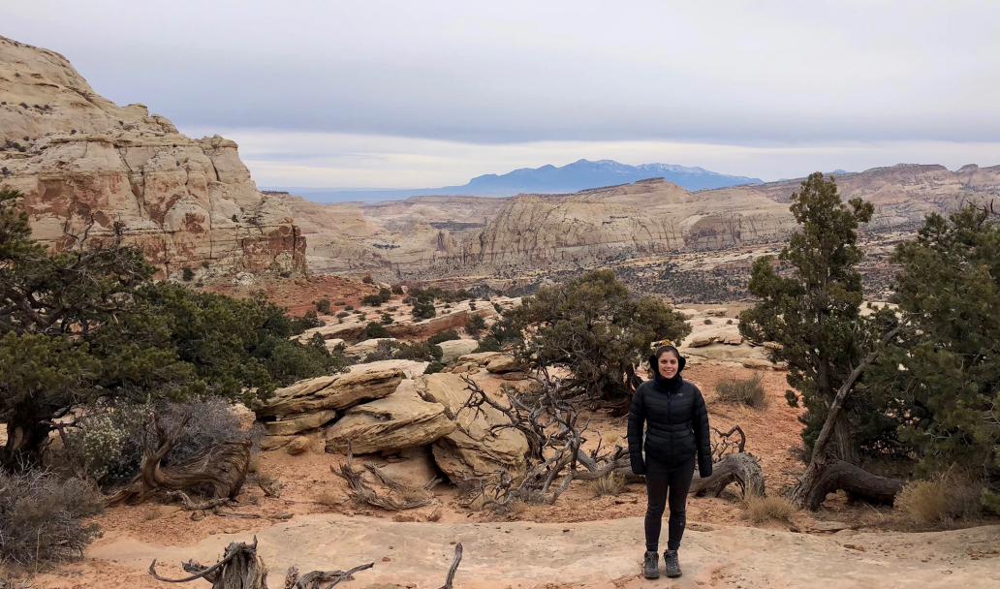

# Hola! 

### About Me / My Job

**TLDR: I am self taught Pythonista who is finishing up her Data Science Masters @ American University Spring 2021. I use SQL and Python (sometimes a bit of R) to help support [AFSCME's](https://afscme.org/) cause.**

**Longer version**: 
 + I do a *lot* of data cleaning in our data warehouse using SQL and create optimal outreach lists for mailing lists and digital communication lists for AFSCME mainly their Retiree Department and the Political Department.
 + I optimized our Join Model in 2020 in R that predicts the likelihood to join our Union and currently working on a new model that predicts the likelihood someone will agree to a Hustle action (digital activist) with Python.
 + In R and SQL I create our polling universes, weight and balance our sample responses, and visualize and report our toplines.
 + I dabble in data engineering and have *automated* or *optimized* our voter file matching from [TargetSmart](https://my.targetsmart.com/) using AWS tools. 
 
What I would like to do in 2021:
+ Put the finishing touches on our Join Model so it runs weekly
+ Finish our Digital Activist Model for Hustle and have a similar deployment production to the Join Model
+ Incorporate more unit testing for code I touch
+ Improve our Polling Methods (better sampling, better weighting, and explore different avenues of polling versus just Phone Calls)
+ Ace the Machine Learning Certification in March 2021.

### Communication 
+ I love a collaborative work environment. I consider myself a friendly and approachable person.
+ I prefer slack and in person versus emails and now in COVID world don't mind a screenshare / zoom call.
+ Happy to learn from anyone and teach anyone anythign I know if they are interested.
+ Triggers : 
  + Assumptions :peach: ; prefer clarity
  + Don't like to manage when I am not a manager (up or sideways) ; happy to collaborate but prefer everyone is accountable
  + Slack on phone (I am very responsive but during lunch hours its lunch hour)
  + Lack of a roadmap ; I like to be on the same page of people 

*Footnote: Outside of work I like to be busy living; I hike :runner:,read :books:, yoga, skincare */play flawless*, travel :airplane:, crochet, go to sleep before 10 :older_woman:, write ( I have two blogs [here](https://medium.com/@monipip3) and [here](https://puertomonica6.wixsite.com/mysite)) and hang out with my friends :dancer:*
